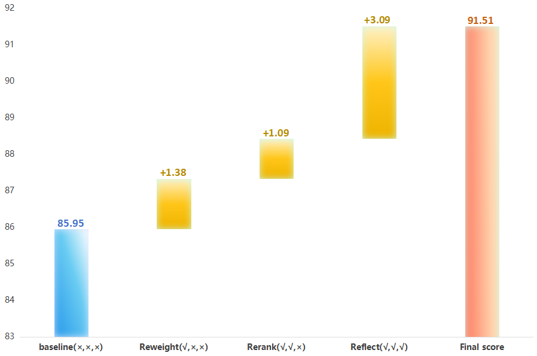

<h1 align=center>R3-RAG</h1>

<p align=center>
  <b>Reweight, Rerank, and Reflect for Evidence-Calibrated Scientific Multimodal Reasoning</b>
</p>

<p align=center>
  Official implementation of the paper accepted by <i>Expert Systems with Applications (ESWA)</i>.
</p>

## News

- **2026-06**: R3-RAG was accepted by *Expert Systems with Applications*.
- **2026-06**: Code and selected result visualizations were released.

## Overview

R3-RAG is a closed-loop multimodal retrieval-augmented generation framework for evidence-calibrated scientific reasoning. It coordinates three components:

1. **Reweight**: intent-aware dynamic multimodal retrieval adapts the balance between visual and textual evidence.
2. **Rerank**: an uncertainty-aware two-stage cascade filters semantically or visually inconsistent evidence.
3. **Reflect**: a diagnose-rewrite-route loop revisits low-confidence retrieval results before final generation.

The framework reaches **91.51% accuracy on ScienceQA** and **48.21% accuracy on the official Science subset of the MMMU test set**.


## Main Results

All values are top-1 accuracy (%). ScienceQA local RAG methods use the same closed-domain 32B evaluation setting.

### ScienceQA

| Method | Natural Science | Social Science | Language Science | Image Context | Average |
| --- | ---: | ---: | ---: | ---: | ---: |
| RagVL | 86.06 | 83.01 | 85.00 | 79.33 | 85.15 |
| Self-RAG | 85.52 | 89.65 | 87.91 | 84.48 | 87.01 |
| CRAG | 71.00 | 73.79 | 89.09 | 66.04 | 76.28 |
| **R3-RAG** | **91.34** | **92.35** | **91.18** | **90.98** | **91.51** |

### MMMU Science Subset

The official Science discipline subset contains 2,713 examples across Agriculture, Biology, Chemistry, Geography, Math, and Physics.

| Method | Agriculture | Biology | Chemistry | Geography | Math | Physics | Overall |
| --- | ---: | ---: | ---: | ---: | ---: | ---: | ---: |
| Qwen2.5-VL-32B | 47.04 | 53.04 | 39.14 | 46.90 | 44.36 | 47.06 | 45.52 |
| RagVL | 44.25 | 50.14 | 40.30 | 41.24 | 40.20 | 45.10 | 42.87 |
| Self-RAG | 45.64 | 49.28 | 34.99 | 48.14 | 37.03 | 44.36 | 42.46 |
| CRAG | 49.13 | 48.41 | 28.36 | 36.99 | 18.81 | 29.17 | 33.25 |
| **R3-RAG** | 47.74 | 44.93 | 38.64 | **49.73** | **50.10** | **61.03** | **48.21** |

### Ablation Study



## Repository Structure

```text
agents/                 Agent orchestration and answer synthesis
configs/                Retrieval and decomposition configuration
dataset/                Dataset download helper
figures/                Framework and result visualizations
models/                 Base model abstractions
prompts/                Prompt templates
retrieval/              Multimodal, graph, vector, web, reranking, and reflection modules
scripts/                Knowledge-base construction, baselines, and result analysis
results*/               Experiment outputs reported by the project
main.py                  Main R3-RAG evaluation entry point
```

Large downloaded datasets, generated indexes, knowledge bases, caches, and runtime logs are intentionally excluded from version control.

## Release Scope and Known Limitations

- ScienceQA and MMMU data are **not included**. Users must obtain them under their respective terms.
- Per-sample prediction JSON files are **not included** because they contain benchmark question and evidence text; aggregate results are reported in the paper.
- Generated LightRAG knowledge bases and multimodal indexes are machine-specific artifacts and are **not included**.
- Model weights and hosted API access are **not included**; exact results depend on matching the paper's model versions, prompts, hardware, and serving parameters.
- Ready-to-run experiment profiles are still a TODO. The current entry point exposes the underlying paths and runtime options through its CLI.

## Installation

Python 3.10 is recommended.

```bash
conda create -n r3-rag python=3.10
conda activate r3-rag
pip install -r requirements.txt
```

Alternatively, create the provided Conda environment:

```bash
conda env create -f environment.yaml
conda activate hmrag
```

Install [Ollama](https://ollama.com/) and prepare the language/vision models required by your configuration. Model weights are not included in this repository.

## Data Preparation

Download ScienceQA with:

```bash
bash dataset/download_ScienceQA.sh
```

Then build the LightRAG knowledge base and multimodal index as needed:

```bash
python scripts/build_lightrag_kb.py --help
```

## Running R3-RAG

Inspect all available options:

```bash
python main.py --help
```

Example:

```bash
python main.py \
  --data_root /path/to/scienceqa/data \
  --image_root /path/to/scienceqa/images \
  --working_dir /path/to/lightrag/workdir \
  --output_root ./outputs \
  --llm_model_name <ollama-model> \
  --rerank_model_name <reranker-model> \
  --clip_model <openclip-architecture> \
  --clip_pretrained <openclip-checkpoint> \
  --lightrag_embed_model <embedding-model>
```

## Paper

- [R3-RAG: Reweight, Rerank, and Reflect for Evidence-Calibrated Scientific Multimodal Reasoning](https://www.sciencedirect.com/science/article/pii/S0957417426020154)

## Citation

The final volume, page range, and DOI are not yet available. Please update the entry below when the article receives its final bibliographic record.

```bibtex
@article{yin2026r3rag,
  title   = {R3-RAG: Reweight, Rerank, and Reflect for Evidence-Calibrated Scientific Multimodal Reasoning},
  author  = {Yin, Zihao and Wang, Tao and Qian, Yurong and Wang, Kai and Hu, Ping and Zhang, Li},
  journal = {Expert Systems with Applications},
  year    = {2026},
  note    = {Accepted}
}
```

## Acknowledgements

The implementation builds on open-source projects including [LightRAG](https://github.com/HKUDS/LightRAG), [Ollama](https://ollama.com/), and [OpenCLIP](https://github.com/mlfoundations/open_clip).
